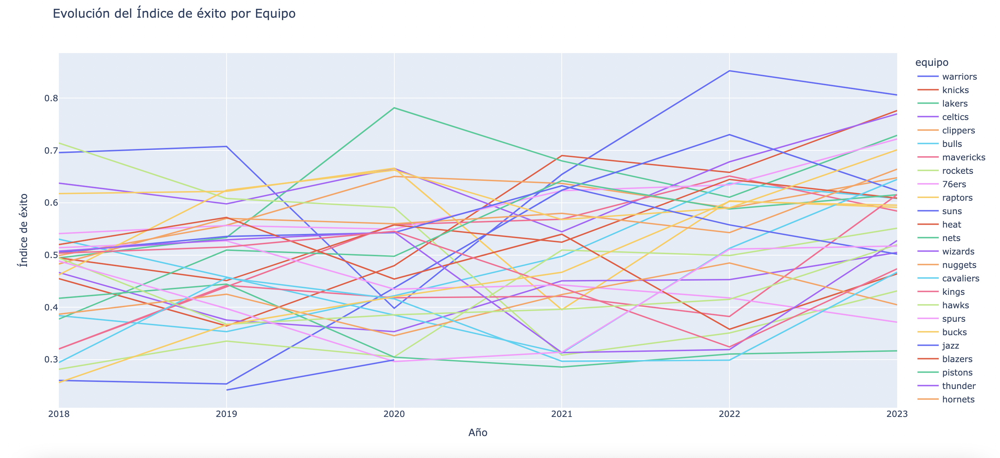

# Crónica

## La dinastía interrumpida de los Golden State Warriors

Aunque no tengas mayor conocmiento de la NBA, probablemente si has escuchado sobre Stephen Curry y los Golden State Warriors. Y es que el equipo del *baby faced assassin* ha sido el mayor verdugo de los últimos 25 años en la NBA, ganando 4 campeonatos en los últimos 10, y siendo el equipo a vencer la mayoría de la última década. 

Sin embargo no todo ha sido éxito (no pun intended) y risas, si no que, como podemos observar en nuestro índice de éxito, el año 2020 tuvieron una caída muy grave, interesante hecho considerando que solo la temporada pasada habían alcanzado las finales. ¿Qué pasó con la última dinastía de la NBA el 2020? ¿Fue culpa del COVID? ¿Qué factor influyo en esta caída?

La verdad es que la drástica caída de los Warriors en cuanto a nuestro índice de éxito fue exclusivamente debida a su rendimiento deportivo. Sorprendente si consideramos todas los logros deportivos que habían logrado los años anteriores. La temporada 2019-20, los Warriors perdieron a sus tres estrellas principales: Kevin Durant, Thompson y Stephen Curry. El primero por un intercambio y los otros dos debido a lesiones.

No solo eso, si no que además, en la mitad de la temporada, cuándo los provenientes de la Bahía de San Francisco sólo llevaban 15 victorias de los 65 partidos que habían disputado y se encontraban con el peor récord de la NBA, el COVID-19 se expandió rápida y muy intensamente. [El incidente de Rudy Gobert](https://www.cnn.com/2020/03/12/sport/rudy-gobert-coronavirus-prank-backlash-spt-intl/index.html) puso en alerta a la NBA y decidió suspender todas las actividades y truncar la temporada hasta ese día. Los que alguna vez fueron los monarcas máximos de la mejor liga de básquetbol del mundo eran ahora los colistas de la misma, en menos de dos años.

Sin embargo, aún cuando deportivamente eran los peores (y con una diferencia cómoda de 4 partidos), definitivamente no eran los menos exitosos. Al menos no en nuestro índice. La razón de este hecho es el gran valor de la franquicia, a partir de ventas de merch, infraestructura, publicidad, etc. [Los Warriors fueron avaluados en 4,3 billones de dólares](https://www.forbes.com/sites/kurtbadenhausen/2020/02/11/nba-team-values-2020-lakers-and-warriors-join-knicks-in-rarefied-4-billion-club/). Esta métrica los mantuvo a flote en nuestro índice y los salvó de una estrepitosa caída en cuanto a éxito.

Pero más importante aún, ayudó a defender nuestra misión que afirma que el éxito en la NBA no sólo se determina por el rendimiento deportivo. Sólo hay que observar a los Warriors.

