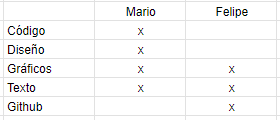

## Entrega 06

Hola profe, última entrega del grupito de basket, aquí le vamos a comentar los cambios que hicimos entre la entrega 5 y esta. 

En cuanto al contenido obviamente hay una mejora en comparación a la entrega anterior, ya que ahora se encuentra todo (o gran mayoría) lo que queríamos tener en nuestra página. Se desarrollan nuevas historias apartir de los gráficos, además de ahondar con más fuerza en el índice que se hizo. 

Continuamos con lo expuesto el viernes pasado y le dimos más importancia al índice que hizo Mario. 

A esto se le suman nuevos gráficos y visualizaciones que acompañan la historia, como lo son las tablas de tradición y del índice, así como también un gráfico de lineas del mismo índice y del valor/ganancia de los tres equipos, sumado a un gráfico de puntos de las rondas jugadas en playoffs junto a los partidos ganados en temporada regular. 

¡Muchas gracias por ser parte de nuestro semestre!

